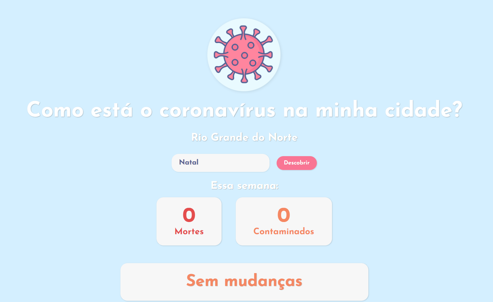

# Covid no RN / Coronavirus in Rio Grande do Norte Brasil state
## Um website para manter contato com as alterações dos casos de covid no estado do Rio Grande do Norto, no Brasil.
## A website to track coronavirus cases in my state.

Esse site foi feito com react e typescript no frontend e node.js com javascript no backend se comunicando com uma api da UERN que nos retornava os dados.

This website was made with react and typescript in frontend and node.js with javascript in backend, communicating with the UERN (Rio Grande do Norte State University) that return the data about the cases.

